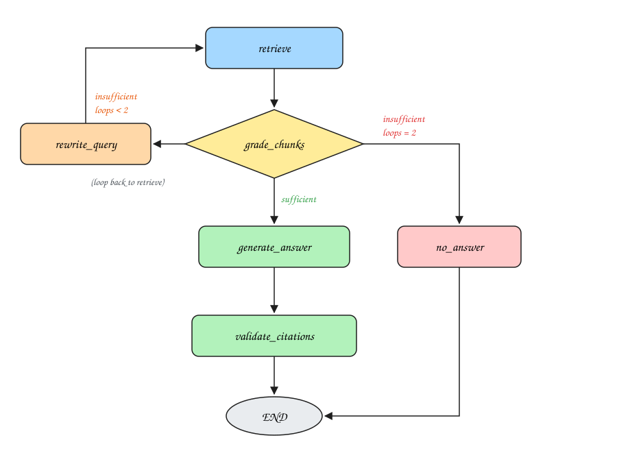

# LangGraph Map

The Q&A workflow is a LangGraph `StateGraph` defined in `app/graph.py`
(`QAService._build_graph`). This page lists every node, what it does, and how
the graph routes between them.

## State

| Field | Type | Meaning |
|---|---|---|
| `question` | str | The user's original question (never mutated) |
| `query` | str | Current retrieval query (empty = use `question`; replaced by `rewrite_query`) |
| `chunks` | list[dict] | Chunks retrieved from Pinecone this pass (`chunk_id`, `score`, `source_file`, `section`, `text`) |
| `grade` | str | `sufficient` / `insufficient` — output of the branch node |
| `loops` | int | How many query rewrites have happened (capped) |
| `found` | bool | Whether the answer was found in the documents |
| `answer` | str | Final answer text (or the refusal sentence) |
| `citations` | list[dict] | Validated citations only |
| `trace` | list[str] | Append-only log of every node execution (returned by `/ask` when `include_trace=true`) |

## Nodes

| Node | What it does |
|---|---|
| `retrieve` | Embeds the current query with Gemini and fetches top-k=4 chunks from Pinecone (with scores + metadata). |
| `grade_chunks` | **The branch node.** Gemini judges whether the retrieved chunks can answer the question, producing `sufficient` (good path) or `insufficient` (bad path). Empty retrieval is always `insufficient`. |
| `rewrite_query` | Bad path, retries remaining: Gemini rephrases the question into a better search query and increments `loops`; control returns to `retrieve`. |
| `generate_answer` | Good path: Gemini answers **using only the chunks** and returns JSON `{found, answer, cited_chunk_ids}`. Instructed to set `found=false` when the chunks don't contain the answer. |
| `validate_citations` | Anti-fabrication gate: keeps only cited chunk IDs that were actually retrieved this run, attaching real `source_file`/`section`/`snippet`/`score`. If nothing valid remains (or `found=false`), replaces the answer with the refusal sentence and empties the citations. |
| `no_answer` | Bad path, retries exhausted: returns the refusal sentence with zero citations. |

## Routing

```
entry: retrieve
retrieve -> grade_chunks
grade_chunks -> generate_answer      if grade == "sufficient"
grade_chunks -> rewrite_query       if grade == "insufficient" and loops < 2
grade_chunks -> no_answer           if grade == "insufficient" and loops == 2
rewrite_query -> retrieve            (the loop)
generate_answer -> validate_citations -> END
no_answer -> END
```

## Diagram



The editable source is [`langgraph.excalidraw`](langgraph.excalidraw) — open it
at https://excalidraw.com (File → Open) to modify and re-export.

## Loop / step limits

Two independent guards ensure the graph cannot spin forever:

1. `loops` counter — at most `max_retrieval_loops = 2` query rewrites
   (`app/config.py`), checked in the conditional edge after `grade_chunks`.
2. `recursion_limit = 25` passed to `graph.invoke()` — a hard LangGraph-level
   backstop on total steps even if the routing logic were broken.
